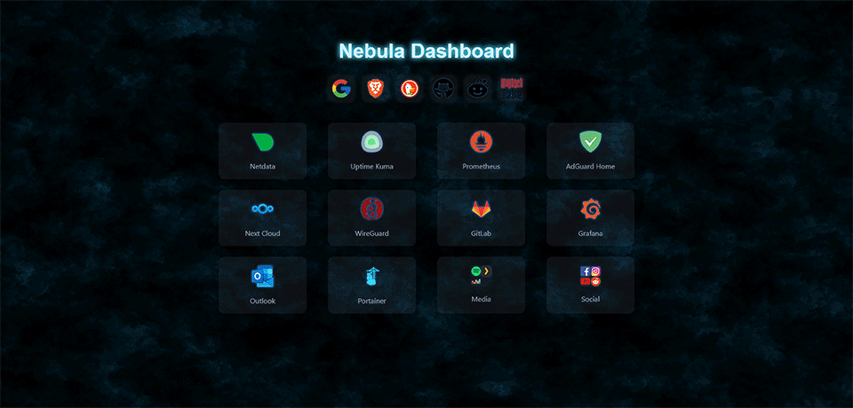

# Nebula Dashboard

**Nebula Dashboard** is a dynamic and customizable web dashboard designed to replace your browser's start page. Built to be self-hosted with Docker, it provides quick access to your local services and lets you launch web searches from a clean and responsive interface.



---

## 🚀 Features

- ✨ Animated and themeable interface (supports Vanta.js and background images)
- 🔍 Smart search bar with customizable search engines
- 🗂️ Simple shortcut management and folder support
- 🏐 Designed to run inside a Docker container (Flask-based)

---

## 📄 Configuration

### ui.json
```json
{
  "title": "Nebula Dashboard",
  "theme": "nebula",
  "cardSize": "medium",
  "cardGap": "1.5rem",
  "columns": 3,
  "defaultSearchEngine": "duckduckgo",
  "searchEngines": ["google", "duckduckgo", "brave", "github", "reddit" ]
}
```

### shortcuts.json
```json
[
  {
    "type": "link",
    "title": "AdGuard",
    "url": "http://192.168.1.1",
    "icon": "config/icons/adguard.png"
  },
  {
    "type": "folder",
    "title": "Dev Tools",
    "children": [
      { "title": "Portainer", "url": "...", "icon": "config/icons/portainer.png" }
    ]
  }
]
```
- The images are to be placed in `config/icons`
---

## 🚀 Launch with Docker

### 1. Download
```bash
git clone 
cd nebula_dashboard
```

### 2. Docker-compose
```bash
docker compose up -d
```

Access to : [http://localhost:5000](http://localhost:5000)

---

## 🎨 Available themes

- `nebula` : dynamic background (Vanta fog)
- `classic` : static background
- `dark` : static background

*Changing the theme is done by modifying only `"theme"` and `ui.json`.*
